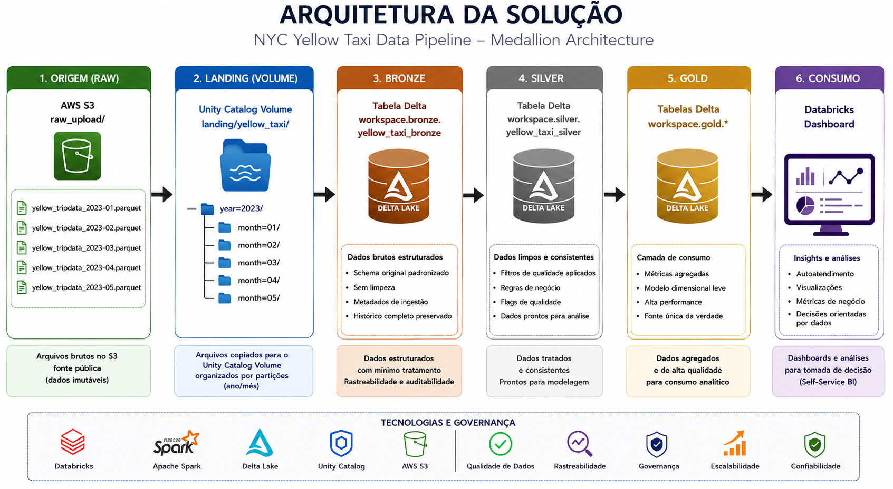
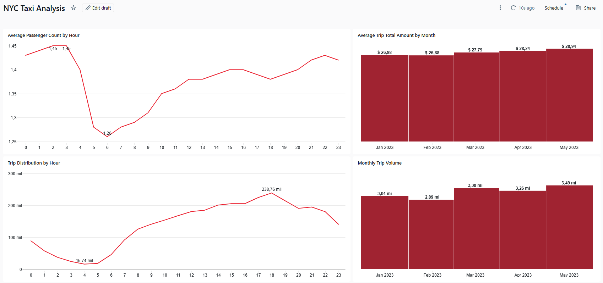

# Documentação Técnica — NYC Yellow Taxi Data Pipeline

## 1. Objetivo

Este projeto tem como objetivo construir um pipeline de dados utilizando uma arquitetura Lakehouse para processamento dos dados públicos de viagens dos táxis amarelos de Nova York (NYC Yellow Taxi).

O desafio propõe responder duas perguntas analíticas:

1.  Qual a média de valor total (total_amount) recebido em um mês considerando todos os yellow táxis da frota?
2. Qual a média de passageiros (passenger_count) por cada hora do dia que pegaram táxi no mês de maio considerando todos os táxis da frota?

Além das respostas finais, a solução busca aplicar boas práticas de Engenharia de Dados, incluindo:

- organização dos dados em camadas (Medallion Architecture)
- processamento distribuído utilizando Apache Spark
- armazenamento em Delta Lake
- tratamento e análise de qualidade dos dados
- rastreabilidade das decisões tomadas
- disponibilização dos dados para consumo analítico

---

# 2. Arquitetura da Solução

A solução foi desenvolvida utilizando:

- AWS S3 para armazenamento dos arquivos brutos
- Databricks como plataforma Lakehouse
- Apache Spark como engine de processamento distribuído
- Delta Lake para armazenamento das tabelas finais

O fluxo implementado segue a arquitetura:



---

# 3. Camada de Ingestão (Bronze)

## Origem dos dados

Os arquivos originais foram armazenados no AWS S3 exatamente como disponibilizados pela fonte:

```text
s3://bucket/ifood-case/raw_upload/

├── yellow_tripdata_2023-01.parquet
├── yellow_tripdata_2023-02.parquet
├── yellow_tripdata_2023-03.parquet
├── yellow_tripdata_2023-04.parquet
└── yellow_tripdata_2023-05.parquet
```

O bucket representa a camada bruta externa, funcionando como uma fonte imutável dos dados.

Durante a ingestão, os arquivos são copiados para um Volume do Unity Catalog no Databricks, organizados em uma estrutura particionada:

```text
landing/yellow_taxi/

year=2023/
 ├── month=01/
 ├── month=02/
 ├── month=03/
 ├── month=04/
 └── month=05/
```

Essa separação permite:

- preservar os dados originais
- criar uma organização otimizada para processamento
- simular uma arquitetura comum de Data Lake corporativo

---

## Tratamento de Schema Drift

Durante a leitura inicial dos arquivos parquet foi identificado erro de incompatibilidade entre schemas dos diferentes meses:

Exemplo:

```text
Expected Spark type double, actual Parquet type INT64
```

A investigação mostrou que algumas colunas tinham tipos diferentes entre arquivos mensais.

Exemplo:

```text
Janeiro:
coluna X → INT64

Maio:
coluna X → DOUBLE
```

Para evitar falhas na leitura conjunta dos arquivos, a ingestão foi alterada para:

```text
Ler arquivo individualmente

        ↓

Padronizar tipos

        ↓

Aplicar casts explícitos

        ↓

Combinar usando unionByName()
```

Essa estratégia garante:

- compatibilidade entre diferentes versões de schema
- menor dependência da estrutura original dos arquivos
- possibilidade de evolução futura do pipeline

---

# 4. Estratégia de Qualidade dos Dados

Antes da aplicação de filtros, foi realizada uma etapa de análise exploratória para diferenciar:

- dados realmente inválidos
- eventos válidos do negócio

A principal premissa adotada foi:

> Nem todo dado inesperado representa um erro.

Uma abordagem agressiva de remoção poderia eliminar eventos reais e gerar viés nas análises finais.

---

# 4.1 Análise — Passenger Count Nulo

Durante o profiling inicial foi identificado um volume significativo de registros sem informação de passageiros.

Resultado:

```text
Registros com passenger_count nulo:
428.665
```

A primeira hipótese seria considerar esses registros inválidos, porém uma investigação adicional foi realizada.

## Distribuição por tipo de pagamento e fornecedor

|payment_type|VendorID|Quantidade|
|-|-|-:|
|0|2|312.323|
|0|1|112.359|
|0|6|3.983|

Observação:

Todos os registros estavam associados ao tipo:

```text
payment_type = 0

Flex Fare Trip
```

Indicando um possível comportamento específico do processo operacional, e não necessariamente uma falha.

---

## Validação das viagens sem passenger_count

Foram avaliadas outras características:

### Valores financeiros

```text
Mediana total_amount:
$24.46

Percentil 75:
$34.14
```

### Distância

```text
Mediana:
2.8 milhas

Percentil 75:
5.13 milhas
```

### Duração

```text
Mediana:
16.58 minutos

Percentil 75:
24 minutos
```

Os registros apresentavam:

- valores financeiros coerentes
- duração compatível
- distância válida

Conclusão:

As viagens sem passenger_count possuem comportamento compatível com viagens reais.

## Decisão tomada

Os registros foram preservados na Silver.

Foram criadas flags:

```text
has_passenger_information

has_valid_passenger_count
```

Dessa forma:

- análises financeiras continuam utilizando esses registros
- análises relacionadas a passageiros podem filtrá-los

---

# 4.2 Análise — Valores Negativos

Durante o profiling foram identificados registros com:

```text
total_amount < 0
```

Inicialmente esses registros poderiam ser interpretados como erro, porém os dados foram analisados considerando o contexto operacional.

## Exemplos encontrados

```text
total_amount | fare_amount | payment_type

-10.10       | -5.10       | 4
-14.30       | -9.30       | 4
-30.40       | -25.40      | 4
-5.50        | -3.00       | 3
```

Distribuição:

|payment_type|Quantidade|
|-|-:|
|4 - Dispute|82.930|
|2 - Cash|32.949|
|3 - No Charge|25.240|

A concentração em tipos como:

- disputa
- sem cobrança
- ajustes financeiros

indica que esses eventos podem representar transações operacionais válidas.

---

## Decisão tomada

Os registros foram preservados.

Flags adicionadas:

```text
has_negative_amount

is_disputed_trip
```

Essa decisão evita alterar artificialmente métricas financeiras, como média de valor recebido.

---

# 4.3 Análise — Distância Igual a Zero

Também foram encontrados registros com:

```text
trip_distance = 0
```

Entretanto, a distância isolada não foi considerada suficiente para invalidar uma viagem.

Algumas viagens apresentavam:

- duração válida
- pagamento registrado
- comportamento compatível com eventos reais

Por isso, foi criada uma regra combinada.

## Regra aplicada

Remover apenas:

```text
trip_distance = 0

AND

trip_duration_minutes < 1
```

Justificativa:

Esses registros não apresentam evidência suficiente de que uma viagem ocorreu.

Impacto:

```text
Registros removidos:
118.736
```

---

# 5. Resultado da Camada Silver

Após as análises, foram removidos apenas registros com forte evidência de inconsistência.

## Regras finais de remoção

|Regra|Justificativa|
|-|-|
|Pickup fora de Jan-Mai/2023|Fora do período esperado do dataset|
|Duração <= 0|Viagem com sequência temporal inválida|
|Distância = 0 e duração < 1 minuto|Sem evidência de deslocamento|

Todos os outros cenários foram preservados com indicadores de qualidade.

---

## Resultado final

```text
Bronze records:
16.186.386

Silver records:
16.066.369

Removed records:
120.017

Removed percentage:
0.74%

Retention percentage:
99.26%
```

Comparação:

Uma abordagem inicial baseada em filtros genéricos removeria aproximadamente:

```text
6.29% dos dados
```

Após investigação:

```text
Somente 0.74% foram removidos
```

---

# 6. Camada Gold

A camada Gold foi criada para disponibilizar métricas prontas para consumo.

As tabelas finais são:

```text
workspace.gold.yellow_taxi_monthly_amount

workspace.gold.yellow_taxi_hourly_passenger
```

---

# 6.1 Valor Médio Recebido por Mês

Pergunta:

> Qual a média de valor total (total_amount) recebido em um mês considerando todos os yellow táxis da frota?

Resultado:

|Mês|Valor médio|Viagens|
|-|-:|-:|
|Jan/2023|26.98|3.043.879|
|Fev/2023|26.88|2.892.533|
|Mar/2023|27.79|3.378.343|
|Abr/2023|28.24|3.264.408|
|Mai/2023|28.94|3.487.206|

Insight:

Foi observado um crescimento gradual do valor médio das viagens ao longo dos meses analisados.

Os eventos financeiros negativos foram mantidos, pois representam ajustes operacionais reais.

---

# 6.2 Média de Passageiros por Hora

Pergunta:

> Qual a média de passageiros (passenger_count) por cada hora do dia que pegaram táxi no mês de maio considerando todos os táxis da frota?

Para essa análise foram considerados apenas registros do mês de Maio com:

```text
has_valid_passenger_count = true
```

Motivo:

Viagens sem informação de passageiros são válidas para análises financeiras, mas não para métricas relacionadas à ocupação.

Observações:

```text
Menor média:
aproximadamente 1.26 passageiros

Maior média:
aproximadamente 1.45 passageiros
```

---

# 7. Dashboard Analítico

Foi criado um dashboard no Databricks utilizando exclusivamente dados da camada Gold.

Métricas disponibilizadas:

- volume mensal de viagens
- valor médio por viagem
- distribuição de viagens por hora
- média de passageiros por viagem por hora

Objetivo:

Simular um cenário de Self-Service Analytics onde consumidores acessam dados tratados e confiáveis sem consultar camadas técnicas.



---

# 8. Conclusões

O principal aprendizado do processo foi que qualidade de dados não deve ser baseada apenas em regras genéricas.

Valores inesperados podem representar:

- eventos operacionais
- exceções de negócio
- ajustes financeiros

A solução priorizou:

- preservação dos dados
- rastreabilidade
- transparência das decisões
- flexibilidade para diferentes casos de uso

Resultado final:

```text
99.26% dos registros preservados

com indicadores permitindo diferentes estratégias analíticas.
```

A arquitetura construída permite evolução futura com:

- execução incremental
- orquestração via Databricks Workflows ou Airflow
- monitoramento contínuo de qualidade
- governança através do Unity Catalog